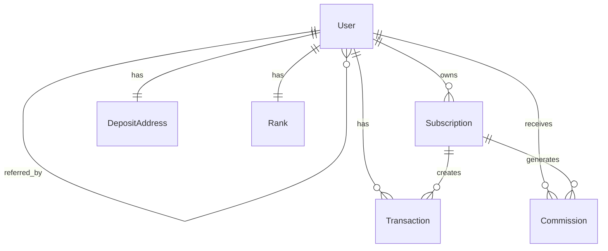

# Phonix MLM Platform - Technical Documentation

**Version:** 1.0  
**Date:** February 2026  
**Framework:** Django 4.2.7  
**Language:** Python 3.9+

---

## Table of Contents

1. [Executive Summary](#executive-summary)
2. [System Architecture](#system-architecture)
3. [Technology Stack](#technology-stack)
4. [Database Design](#database-design)
5. [Core Modules](#core-modules)
6. [Business Logic](#business-logic)
7. [API Reference](#api-reference)
8. [Security Implementation](#security-implementation)
9. [Deployment Guide](#deployment-guide)
10. [Maintenance & Operations](#maintenance--operations)

---

## 1. Executive Summary

### 1.1 Project Overview

Phonix is a comprehensive Multi-Level Marketing (MLM) investment platform built with Django, featuring:

- **20-Level Referral System** with tiered commission structure
- **TRC20 USDT Integration** for deposits and withdrawals
- **Automated Earnings Distribution** via Celery task queue
- **Rank-Based Bonus System** with weekly payouts
- **3x Earnings Cap** for sustainable growth

### 1.2 Key Features

| Feature | Description |
|---------|-------------|
| Investment Tiers | 3 tiers ($50-$3K, $3K-$5K, $5K+) with 6%, 8%, 10% monthly returns |
| Daily Income | Automated distribution Monday-Friday |
| Commission Levels | 20 levels with rates from 10% down to 0.3% |
| Blockchain | TRC20 USDT on TRON network |
| Automation | Celery + Redis for background tasks |
| Ranks | 6 rank tiers with $50-$5,000 weekly bonuses |

### 1.3 System Metrics

- **Estimated Capacity:** 10,000+ users
- **Concurrent Users:** ~100
- **Database:** PostgreSQL (production), SQLite (development)
- **Task Processing:** Celery with Redis broker
- **Blockchain Network:** TRON (TRC20)

---

## 2. System Architecture

### 2.1 High-Level Architecture

```
┌─────────────────────────────────────────────────────────┐
│                    CLIENT LAYER                          │
│  Web Browser → Django Templates → User Dashboard        │
└─────────────────────────────────────────────────────────┘
                         ↓ HTTPS
┌─────────────────────────────────────────────────────────┐
│                 APPLICATION LAYER                        │
│  ┌──────────────────────────────────────────────────┐  │
│  │  Django Apps: accounts | investment | wallet |   │  │
│  │               earnings | ranks | dashboard       │  │
│  └──────────────────────────────────────────────────┘  │
└─────────────────────────────────────────────────────────┘
         ↓                              ↓
┌──────────────────┐          ┌──────────────────┐
│   TASK QUEUE     │          │   DATA LAYER     │
│  Redis + Celery  │  ←──→    │   PostgreSQL     │
└──────────────────┘          └──────────────────┘
         ↓
┌──────────────────────────────────────────────────────────┐
│              BLOCKCHAIN LAYER                             │
│  TRON Network (TRC20 USDT) via TronGrid API              │
└──────────────────────────────────────────────────────────┘
```

### 2.2 Application Structure

```
Phonix/
├── accounts/          # User authentication & MLM structure
├── investment/        # Subscription packages
├── wallet/            # TRC20 deposits/withdrawals
├── earnings/          # Commission distribution
├── ranks/             # Rank advancement & bonuses
├── dashboard/         # User interface
├── phonix/            # Project settings & configuration
├── static/            # CSS, JS, images
├── templates/         # HTML templates
└── docs/              # Documentation
```

---

## 3. Technology Stack

### 3.1 Backend

| Component | Technology | Version | Purpose |
|-----------|-----------|---------|---------|
| Framework | Django | 4.2.7 | Web framework |
| Language | Python | 3.9+ | Programming language |
| Database | PostgreSQL | 12+ | Primary database |
| Cache/Queue | Redis | 6.0+ | Message broker & cache |
| Task Queue | Celery | 5.3.4 | Async task processing |
| Blockchain SDK | TronPy | 0.4.0 | TRON integration |

### 3.2 Key Dependencies

```python
Django==4.2.7
psycopg2-binary==2.9.9
celery==5.3.4
redis==5.0.1
django-celery-beat==2.5.0
tronpy==0.4.0
djangorestframework==3.14.0
python-decouple==3.8
gunicorn==21.2.0
cryptography==41.0.7
```

### 3.3 Deployment Stack

- **Web Server:** Gunicorn (WSGI)
- **Reverse Proxy:** Nginx
- **Process Manager:** Systemd
- **SSL/TLS:** Let's Encrypt (Certbot)

---

## 4. Database Design

### 4.1 Entity Relationship Diagram



### 4.2 Core Models

#### User Model (accounts.User)

Extends Django's AbstractUser with MLM fields.

| Field | Type | Description |
|-------|------|-------------|
| wallet_balance | Decimal(12,2) | Main USDT wallet balance |
| registration_bonus | Decimal(5,2) | $10 registration bonus |
| referred_by | ForeignKey(User) | Upline referrer |
| referral_code | CharField(10) | Unique referral code |
| total_earnings | Decimal(12,2) | Total all-time earnings |
| total_invested | Decimal(12,2) | Total subscription investments |
| direct_referrals_count | Integer | Count of direct referrals |
| trc20_wallet_address | CharField(50) | Withdrawal address |

**Key Methods:**
- `can_receive_commission(amount)` - Check 3x cap
- `get_available_commission_amount()` - Remaining capacity
- `earnings_cap_percentage()` - Cap percentage reached

#### Subscription Model (investment.Subscription)

Investment packages with tiered returns.

| Field | Type | Description |
|-------|------|-------------|
| user | ForeignKey(User) | Subscription owner |
| amount | Decimal(10,2) | Investment amount |
| tier | CharField(10) | tier_1, tier_2, or tier_3 |
| monthly_rate | Decimal(4,2) | 6%, 8%, or 10% |
| total_earned | Decimal(10,2) | Total earned from subscription |
| earnings_cap | Decimal(10,2) | 3x the amount |
| is_active | Boolean | Active for earning |
| bonus_used | Decimal(5,2) | Registration bonus used |

**Tier Structure:**
- Tier 1: $50-$3,000 @ 6% monthly
- Tier 2: $3,001-$5,000 @ 8% monthly
- Tier 3: $5,001+ @ 10% monthly

#### Transaction Model (wallet.Transaction)

Tracks all financial movements.

| Field | Type | Description |
|-------|------|-------------|
| user | ForeignKey(User) | Transaction owner |
| type | CharField(20) | deposit, withdrawal, purchase, commission, etc. |
| amount | Decimal(12,2) | Gross amount |
| txn_hash | CharField(100) | Blockchain transaction hash |
| fee | Decimal(8,2) | Transaction fee (5% for withdrawals) |
| status | CharField(20) | pending, processing, completed, failed |
| subscription | ForeignKey(Subscription) | Related subscription (optional) |

**Transaction Types:**
- `deposit` - TRC20 USDT deposit
- `withdrawal` - TRC20 USDT withdrawal (5% fee)
- `purchase` - Subscription purchase
- `commission` - Referral commission
- `daily_income` - Daily bond income
- `weekly_bonus` - Weekly rank bonus

#### Commission Model (earnings.Commission)

Tracks MLM commission payments.

| Field | Type | Description |
|-------|------|-------------|
| user | ForeignKey(User) | Commission recipient |
| from_user | ForeignKey(User) | Who generated commission |
| level | Integer | Level in upline chain (1-20) |
| amount | Decimal(10,2) | Commission amount |
| commission_type | CharField(20) | generation or daily_bond |
| source_subscription | ForeignKey(Subscription) | Source subscription |

**Commission Rates:**
```python
Level 1:  10.0%    Level 11: 0.5%
Level 2:  5.0%     Level 12: 0.5%
Level 3:  3.0%     Level 13: 0.5%
Level 4:  2.0%     Level 14: 0.5%
Level 5:  2.0%     Level 15: 0.5%
Level 6:  1.0%     Level 16: 0.3%
Level 7:  1.0%     Level 17: 0.3%
Level 8:  1.0%     Level 18: 0.3%
Level 9:  1.0%     Level 19: 0.3%
Level 10: 1.0%     Level 20: 0.3%
```

**Direct Requirements:**
- Levels 1-2: No requirement
- Levels 3-4: 2 direct referrals
- Levels 5-6: 3 direct referrals
- Levels 7-8: 4 direct referrals
- ...continuing up to...
- Levels 19-20: 10 direct referrals

---

## 5. Core Modules

### 5.1 Accounts Module

**Purpose:** User authentication and MLM structure management

**Key Files:**
- `models.py` - Custom User model
- `views.py` - Registration, login, profile
- `utils.py` - MLM helper functions

**Features:**
- Custom user registration with referral tracking
- Automatic referral code generation
- 3x earnings cap enforcement
- Direct referral counting

### 5.2 Investment Module

**Purpose:** Subscription package management

**Key Files:**
- `models.py` - Subscription model
- `views.py` - Package purchase, subscription list
- `utils.py` - Tier calculation

**Features:**
- Auto-tier calculation based on amount
- Daily income calculation
- 3x earnings cap per subscription
- Bonus usage tracking (10% max, $1 cap)

### 5.3 Wallet Module

**Purpose:** Cryptocurrency operations

**Key Files:**
- `models.py` - Transaction, DepositAddress models
- `tasks.py` - Deposit monitoring, withdrawal processing
- `tron_utils.py` - TRC20 blockchain utilities
- `encryption.py` - Private key encryption

**Features:**
- Unique TRC20 deposit address per user
- Automated deposit detection (every minute)
- Withdrawal processing with 5% fee
- Private key encryption (Fernet)

### 5.4 Earnings Module

**Purpose:** Commission and earnings distribution

**Key Files:**
- `models.py` - Commission model and rates
- `tasks.py` - Daily bond income, generation income
- `utils.py` - Commission calculation logic

**Celery Tasks:**
- `calculate_daily_bond_income()` - Runs Mon-Fri 12:00 AM UTC
- `distribute_generation_income(subscription_id)` - Triggered on purchase

### 5.5 Ranks Module

**Purpose:** Rank advancement and bonuses

**Key Files:**
- `models.py` - Rank model
- `tasks.py` - Rank checks, weekly bonuses
- `utils.py` - Leg volume calculations

**Rank Tiers:**

| Rank | Main Leg | Other Legs | Weekly Bonus |
|------|----------|------------|--------------|
| Connector | $5,000 | $5,000 | $50 |
| Builder | $10,000 | $10,000 | $200 |
| Professional | $20,000 | $20,000 | $500 |
| Executive | $50,000 | $50,000 | $1,000 |
| Director | $100,000 | $100,000 | $2,000 |
| Crown | $200,000 | $200,000 | $5,000 |

---

## 6. Business Logic

### 6.1 User Registration Flow

```python
1. User visits registration page (optional: with referral code)
2. Submit registration form
3. Validate form data
4. Check referral code exists (if provided)
5. Create User with referred_by set
6. Generate unique referral code
7. Credit $10 registration bonus
8. Update upline's direct_referrals_count
9. Log user in
10. Redirect to dashboard
```

### 6.2 Subscription Purchase Flow

```python
1. User selects package amount
2. Validate sufficient balance (wallet + bonus)
3. Calculate tier and monthly rate
4. Calculate bonus usage (10% max, $1 cap)
5. Deduct from wallet/bonus
6. Create Subscription record
7. Update user.total_invested
8. Create PURCHASE transaction
9. Trigger distribute_generation_income task
10. Calculate 20-level commissions
11. For each upline (up to 20 levels):
    - Check direct referral requirements
    - Check 3x earnings cap
    - Credit commission if eligible
    - Create Commission record
12. Redirect to subscription detail
```

### 6.3 Daily Bond Income Distribution

```python
# Runs Monday-Friday at 12:00 AM UTC
1. Get all active subscriptions
2. For each subscription:
    - Calculate daily income: (amount * monthly_rate / 100) / 30
    - Check if subscription can earn (not at 3x cap)
    - Check if user can receive (not at 3x cap)
    - Credit amount (full or partial)
    - Update subscription.total_earned
    - Update user.total_earnings
    - If 3x cap reached: mark subscription inactive
    - Create DAILY_INCOME transaction
3. Log distribution summary
```

### 6.4 TRC20 Deposit Flow

```python
# Runs every minute
1. Get all deposit addresses
2. For each address:
    - Query TRON blockchain for transactions
    - Check for new USDT transfers
    - If new deposit found:
        - Verify transaction details
        - Check confirmations (wait for 19+)
        - Create DEPOSIT transaction (pending)
        - Once confirmed:
            - Credit user.wallet_balance
            - Mark transaction completed
            - Send email notification
```

### 6.5 Withdrawal Flow

```python
1. User requests withdrawal
2. Validate amount <= wallet_balance
3. Validate TRC20 address format
4. Calculate 5% fee
5. Deduct from wallet_balance
6. Create WITHDRAWAL transaction (pending)
7. Admin approval required
8. After approval:
    - Celery task: process_withdrawal_crypto
    - Get master wallet private key
    - Sign and send TRC20 transaction
    - If successful: mark completed, save txn_hash
    - If failed: mark failed, refund user
9. Send email notification
```

### 6.6 3x Earnings Cap Logic

The 3x cap is enforced at multiple levels:

```python
# User Level
max_earnings = user.total_invested * 3
can_earn = (user.total_earnings + amount) <= max_earnings

# Subscription Level
max_earnings = subscription.amount * 3
can_earn = (subscription.total_earned + amount) <= max_earnings

# Commission Distribution
if user.can_receive_commission(commission_amount):
    credit_full_amount()
else:
    available = user.get_available_commission_amount()
    credit_partial_amount(available)
```

---

## 7. API Reference

### 7.1 URL Structure

```
/admin/                     # Django Admin Panel
/dashboard/                 # Main dashboard
/dashboard/login/           # Login page
/dashboard/register/        # Registration page
/dashboard/profile/         # User profile
/dashboard/genealogy/       # Downline structure
/investment/                # Subscription list
/investment/purchase/       # Purchase subscription
/investment/<id>/           # Subscription detail
/wallet/                    # Wallet overview
/wallet/deposit/            # Deposit page
/wallet/withdraw/           # Withdrawal page
/wallet/transactions/       # Transaction history
```

### 7.2 Key Views

#### Dashboard Index
- **URL:** `/dashboard/`
- **Method:** GET
- **Auth:** Required
- **Returns:** User stats, active subscriptions, recent transactions

#### Register
- **URL:** `/dashboard/register/`
- **Method:** GET, POST
- **Auth:** Not required
- **POST Data:** username, email, password1, password2, referral_code (optional)

#### Purchase Subscription
- **URL:** `/investment/purchase/`
- **Method:** GET, POST
- **Auth:** Required
- **POST Data:** amount, use_bonus
- **Validation:** amount >= $50, sufficient balance

#### Withdraw
- **URL:** `/wallet/withdraw/`
- **Method:** GET, POST
- **Auth:** Required
- **POST Data:** amount, wallet_address
- **Fee:** 5% of amount

---

## 8. Security Implementation

### 8.1 Authentication & Authorization

- **Django Auth System:** Built-in user authentication
- **Session-based auth:** Secure session cookies
- **Password Hashing:** PBKDF2 with SHA256
- **CSRF Protection:** Enabled on all forms

### 8.2 Data Protection

**Private Key Encryption:**
```python
from cryptography.fernet import Fernet

# Encrypt private key before storing
encrypted_key = encrypt_private_key(private_key)

# Decrypt only when needed
private_key = decrypt_private_key(encrypted_key)
```

**Environment Variables:**
- Master wallet key stored in `.env`
- Never committed to version control
- Encrypted user deposit address keys

### 8.3 3x Earnings Cap

Enforced at multiple levels to prevent abuse:
- User model validation
- Subscription model validation
- Commission distribution checks
- Transaction creation validation

### 8.4 Input Validation

- Django Forms for server-side validation
- Model validators for database constraints
- Decimal type for financial calculations
- SQL injection protection via Django ORM

### 8.5 Production Security Settings

```python
# settings.py (production)
DEBUG = False
SECURE_SSL_REDIRECT = True
SESSION_COOKIE_SECURE = True
CSRF_COOKIE_SECURE = True
SECURE_BROWSER_XSS_FILTER = True
SECURE_CONTENT_TYPE_NOSNIFF = True
X_FRAME_OPTIONS = 'DENY'
```

---

## 9. Deployment Guide

### 9.1 Server Requirements

- **OS:** Ubuntu 20.04+ or similar Linux
- **Python:** 3.9+
- **PostgreSQL:** 12+
- **Redis:** 6.0+
- **Nginx:** Latest stable
- **Domain:** With DNS configured
- **SSL:** Let's Encrypt certificate

### 9.2 Installation Steps

```bash
# 1. Update system
sudo apt update && sudo apt upgrade -y

# 2. Install dependencies
sudo apt install python3-pip python3-venv postgresql redis-server nginx git -y

# 3. Create database
sudo -u postgres psql
CREATE DATABASE phonix_db;
CREATE USER phonix_user WITH PASSWORD 'secure_password';
GRANT ALL PRIVILEGES ON DATABASE phonix_db TO phonix_user;

# 4. Clone project
cd /var/www/
sudo git clone <repo-url> phonix
cd phonix

# 5. Setup virtual environment
python3 -m venv venv
source venv/bin/activate
pip install -r requirements.txt

# 6. Configure environment
cp .env.example .env
nano .env  # Edit with production values

# 7. Run migrations
python manage.py migrate
python manage.py createsuperuser
python manage.py collectstatic

# 8. Setup Gunicorn service
sudo nano /etc/systemd/system/gunicorn.service
# (Add service configuration)

# 9. Setup Celery services
sudo nano /etc/systemd/system/celery.service
sudo nano /etc/systemd/system/celerybeat.service

# 10. Configure Nginx
sudo nano /etc/nginx/sites-available/phonix
sudo ln -s /etc/nginx/sites-available/phonix /etc/nginx/sites-enabled/

# 11. Get SSL certificate
sudo certbot --nginx -d yourdomain.com

# 12. Start services
sudo systemctl start gunicorn celery celerybeat
sudo systemctl enable gunicorn celery celerybeat
sudo systemctl restart nginx
```

### 9.3 Environment Variables

```bash
# Django
SECRET_KEY=your-secret-key
DEBUG=False
ALLOWED_HOSTS=yourdomain.com,www.yourdomain.com

# Database
DB_ENGINE=django.db.backends.postgresql
DB_NAME=phonix_db
DB_USER=phonix_user
DB_PASSWORD=secure_password
DB_HOST=localhost
DB_PORT=5432

# Redis
REDIS_URL=redis://localhost:6379/0

# TRC20
TRON_API_KEY=your-trongrid-api-key
TRON_NETWORK=mainnet
MASTER_WALLET_ADDRESS=your-trc20-address
MASTER_WALLET_KEY=your-private-key-hex

# Email
EMAIL_HOST=smtp.gmail.com
EMAIL_PORT=587
EMAIL_USE_TLS=True
EMAIL_HOST_USER=your-email@gmail.com
EMAIL_HOST_PASSWORD=your-app-password
```

---

## 10. Maintenance & Operations

### 10.1 Monitoring

**Key Metrics to Track:**
- Active users count
- Total subscriptions value
- Daily commission distribution
- Withdrawal processing time
- Deposit detection latency
- Celery task success/failure rate

**Log Locations:**
```bash
# Application logs
/var/log/gunicorn/

# Nginx logs
/var/log/nginx/access.log
/var/log/nginx/error.log

# System services
journalctl -u gunicorn
journalctl -u celery
journalctl -u celerybeat
```

### 10.2 Backup Strategy

**Database Backup:**
```bash
# Create backup script
#!/bin/bash
DATE=$(date +%Y%m%d_%H%M%S)
pg_dump phonix_db > /backups/phonix_backup_$DATE.sql

# Add to cron (daily at 2 AM)
0 2 * * * /usr/local/bin/backup-phonix.sh
```

**Files to Backup:**
- Database dumps
- Media files
- Environment configuration (.env)
- SSL certificates

### 10.3 Common Maintenance Tasks

```bash
# Restart services
sudo systemctl restart gunicorn celery celerybeat nginx

# Update application
cd /var/www/phonix
source venv/bin/activate
git pull
pip install -r requirements.txt
python manage.py migrate
python manage.py collectstatic --noinput
sudo systemctl restart gunicorn celery celerybeat

# Check service status
sudo systemctl status gunicorn
sudo systemctl status celery
sudo systemctl status celerybeat

# View logs
sudo journalctl -u gunicorn -f
sudo journalctl -u celery -f
```

### 10.4 Troubleshooting

**Database Connection Error:**
```bash
sudo systemctl status postgresql
sudo systemctl start postgresql
```

**Redis Connection Error:**
```bash
redis-cli ping
sudo systemctl start redis-server
```

**Celery Tasks Not Running:**
```bash
# Check worker status
celery -A phonix inspect active

# Purge queue
celery -A phonix purge

# Restart workers
sudo systemctl restart celery celerybeat
```

---

## Appendix A: Celery Task Schedule

```python
CELERY_BEAT_SCHEDULE = {
    'calculate-daily-bond-income': {
        'task': 'earnings.tasks.calculate_daily_bond_income',
        'schedule': crontab(hour=0, minute=0, day_of_week='mon-fri'),
    },
    'distribute-weekly-bonuses': {
        'task': 'ranks.tasks.distribute_weekly_bonuses',
        'schedule': crontab(hour=0, minute=0, day_of_week='mon'),
    },
    'check-rank-advancements': {
        'task': 'ranks.tasks.check_rank_advancements',
        'schedule': crontab(hour=23, minute=0, day_of_week='sun'),
    },
    'monitor-trc20-deposits': {
        'task': 'wallet.tasks.monitor_deposits',
        'schedule': crontab(minute='*/1'),
    },
    'consolidate-deposits': {
        'task': 'wallet.tasks.consolidate_deposits',
        'schedule': crontab(hour=3, minute=0),
    },
}
```

---

## Appendix B: Useful Commands

```bash
# Database
python manage.py makemigrations
python manage.py migrate
python manage.py dbshell

# Admin
python manage.py createsuperuser
python manage.py changepassword username

# Shell
python manage.py shell

# Static files
python manage.py collectstatic

# Celery
celery -A phonix worker -l info
celery -A phonix beat -l info
celery -A phonix inspect active
celery -A phonix purge

# Testing
python manage.py test
python create_test_users.py
python verify_mlm.py
python test_trc20_setup.py
```

---

**Document End**

For additional information, refer to:
- [README.md](README.md) - Project overview
- [INSTALLATION.md](INSTALLATION.md) - Detailed installation guide
- [DEPLOYMENT.md](DEPLOYMENT.md) - Production deployment
- [docs/ARCHITECTURE.md](docs/ARCHITECTURE.md) - System architecture
- [docs/DATABASE_SCHEMA.md](docs/DATABASE_SCHEMA.md) - Database schema
- [docs/API_DOCUMENTATION.md](docs/API_DOCUMENTATION.md) - API reference
