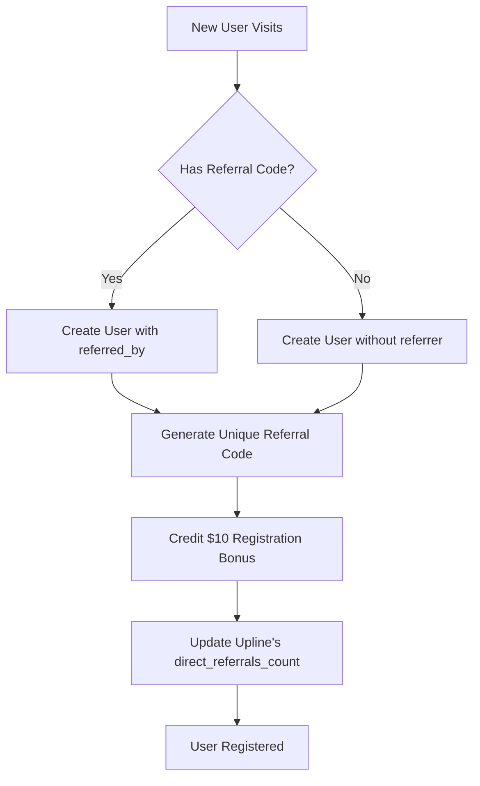
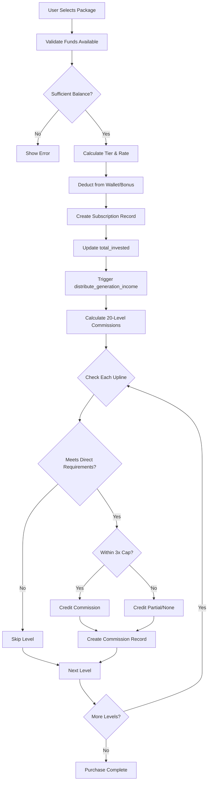
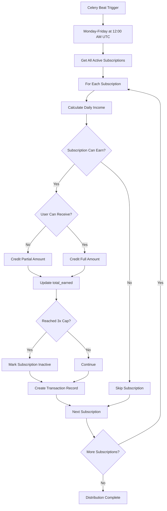
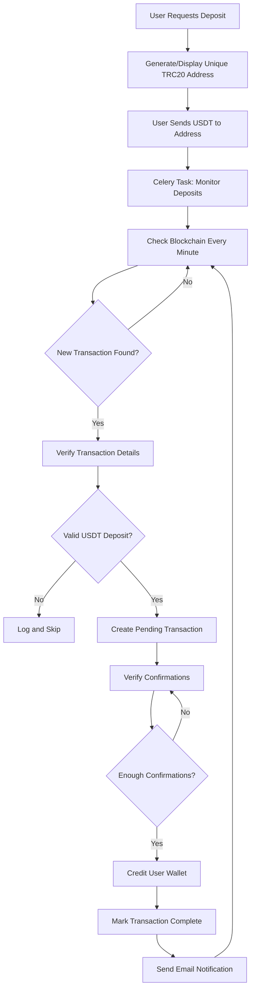
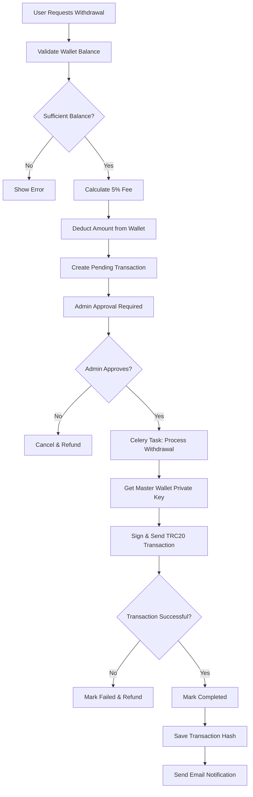

# System Architecture - Phonix MLM Platform

This document provides a comprehensive overview of the Phonix MLM platform's architecture, design patterns, and technical implementation.

## Table of Contents

1. [High-Level Architecture](#high-level-architecture)
2. [Application Structure](#application-structure)
3. [Data Flow](#data-flow)
4. [Key Components](#key-components)
5. [Technology Stack](#technology-stack)
6. [Design Patterns](#design-patterns)
7. [Security Architecture](#security-architecture)
8. [Scalability Considerations](#scalability-considerations)

## High-Level Architecture

### System Diagram

```
┌─────────────────────────────────────────────────────────────────┐
│                          CLIENT TIER                             │
│  ┌──────────────┐  ┌──────────────┐  ┌──────────────┐          │
│  │   Web UI     │  │  Dashboard   │  │  Admin Panel │          │
│  │  (Browser)   │  │  Interface   │  │   (Django)   │          │
│  └──────────────┘  └──────────────┘  └──────────────┘          │
└─────────────────────────────────────────────────────────────────┘
                             ↓ HTTPS
┌─────────────────────────────────────────────────────────────────┐
│                      APPLICATION TIER                            │
│  ┌──────────────────────────────────────────────────────┐       │
│  │              Django Web Framework                     │       │
│  │                                                        │       │
│  │  ┌──────┐  ┌──────┐  ┌──────┐  ┌──────┐  ┌──────┐  │       │
│  │  │Accnts│  │Invest│  │Wallet│  │Earngs│  │Ranks │  │       │
│  │  │      │  │ment  │  │      │  │      │  │      │  │       │
│  │  └──────┘  └──────┘  └──────┘  └──────┘  └──────┘  │       │
│  │                                                        │       │
│  │  Models • Views • Templates • Utils                   │       │
│  └──────────────────────────────────────────────────────┘       │
│                                                                   │
│  ┌──────────────────────────────────────────────────────┐       │
│  │         Django REST Framework API                     │       │
│  │         (Optional - Future Enhancement)               │       │
│  └──────────────────────────────────────────────────────┘       │
└─────────────────────────────────────────────────────────────────┘
            ↓                              ↓
┌────────────────────────┐    ┌──────────────────────────┐
│   TASK QUEUE TIER      │    │    DATA TIER             │
│                        │    │                          │
│  ┌─────────────────┐  │    │  ┌────────────────────┐  │
│  │  Redis Queue    │  │    │  │   PostgreSQL DB    │  │
│  │   (Broker)      │  │    │  │                    │  │
│  └─────────────────┘  │    │  │  - User Data       │  │
│          ↓            │    │  │  - Transactions    │  │
│  ┌─────────────────┐  │    │  │  - Subscriptions   │  │
│  │  Celery Worker  │←─┼───→│  │  - Commissions     │  │
│  │   (Async Tasks) │  │    │  │  - Ranks           │  │
│  └─────────────────┘  │    │  └────────────────────┘  │
│          ↓            │    │                          │
│  ┌─────────────────┐  │    │  ┌────────────────────┐  │
│  │  Celery Beat    │  │    │  │  Redis Cache       │  │
│  │  (Scheduler)    │  │    │  │  (Session/Cache)   │  │
│  └─────────────────┘  │    │  └────────────────────┘  │
└────────────────────────┘    └──────────────────────────┘
            ↓
┌─────────────────────────────────────────────────────────────────┐
│                     BLOCKCHAIN TIER                              │
│  ┌──────────────────────────────────────────────────────┐       │
│  │              TRON Blockchain Network                  │       │
│  │                                                        │       │
│  │  ┌──────────────┐  ┌──────────────┐  ┌───────────┐  │       │
│  │  │   TRC20 USDT │  │ User Deposit │  │  Master   │  │       │
│  │  │   Contract   │  │   Addresses  │  │  Wallet   │  │       │
│  │  └──────────────┘  └──────────────┘  └───────────┘  │       │
│  │                                                        │       │
│  │  Via TronGrid API (HTTP/HTTPS)                        │       │
│  └──────────────────────────────────────────────────────┘       │
└─────────────────────────────────────────────────────────────────┘
```

## Application Structure

### Django Apps Architecture

The platform follows Django's app-based architecture with clear separation of concerns:

```
Phonix Platform
├── accounts/          # User Authentication & MLM Structure
│   ├── Models         - Custom User with MLM fields
│   ├── Views          - Registration, login, profile
│   └── Utils          - MLM helper functions
│
├── investment/        # Subscription Management
│   ├── Models         - Subscription with tiered returns
│   ├── Views          - Package purchase, subscription list
│   └── Utils          - Tier calculation, earnings validation
│
├── wallet/            # Cryptocurrency Operations
│   ├── Models         - Transaction, DepositAddress
│   ├── Tasks          - Deposit monitoring, withdrawal processing
│   ├── Views          - Deposit, withdrawal, transaction history
│   └── Utils          - TRC20 blockchain integration
│
├── earnings/          # Commission Distribution
│   ├── Models         - Commission tracking
│   ├── Tasks          - Daily bond income, generation income
│   ├── Views          - Earnings dashboard, commission history
│   └── Utils          - Commission calculation logic
│
├── ranks/             # Rank System & Bonuses
│   ├── Models         - Rank with leg volumes
│   ├── Tasks          - Rank advancement, weekly bonuses
│   ├── Views          - Rank dashboard, genealogy
│   └── Utils          - Leg volume calculations
│
└── dashboard/         # Central Dashboard
    ├── Views          - Main dashboard, statistics
    └── Templates      - UI layouts, components
```

## Data Flow

### User Registration & Referral Flow



### Subscription Purchase Flow



### Daily Bond Income Distribution



### TRC20 Deposit Flow



### Withdrawal Flow



## Key Components

### 1. User Model (accounts/models.py)

**Purpose**: Extended Django User with MLM-specific fields

**Key Features**:
- Custom referral code generation
- 3x earnings cap tracking
- Wallet balance management
- Direct referral counting
- TRC20 wallet address storage

**Key Methods**:
- `can_receive_commission(amount)` - Check 3x cap
- `get_available_commission_amount()` - Remaining earnings capacity
- `update_direct_referrals_count()` - Sync direct referral count

### 2. Subscription Model (investment/models.py)

**Purpose**: Manage investment packages with tiered returns

**Key Features**:
- Auto-tier calculation based on amount
- Daily income calculation
- 3x earnings cap per subscription
- Bonus usage tracking

**Commission Tiers**:
- Tier 1: $50-$3,000 @ 6% monthly
- Tier 2: $3,001-$5,000 @ 8% monthly
- Tier 3: $5,001+ @ 10% monthly

### 3. Transaction Model (wallet/models.py)

**Purpose**: Track all financial movements

**Transaction Types**:
- Deposit (TRC20 USDT)
- Withdrawal (TRC20 USDT with 5% fee)
- Purchase (Subscription)
- Commission (Referral earnings)
- Bonus (Registration bonus)
- Daily Income (Bond returns)
- Weekly Bonus (Rank bonuses)

**Status Flow**: Pending → Processing → Completed/Failed

### 4. Commission Model (earnings/models.py)

**Purpose**: Track MLM commission distribution

**20-Level Structure**:
```python
COMMISSION_RATES = {
    1: 10%,   # Direct referrals
    2: 5%,    # Second level
    3-5: 3-2%,
    6-10: 1%,
    11-15: 0.5%,
    16-20: 0.3%
}

DIRECT_REQUIREMENTS = {
    3-4: 2 directs,
    5-6: 3 directs,
    7-8: 4 directs,
    ...
    19-20: 10 directs
}
```

### 5. Rank Model (ranks/models.py)

**Purpose**: Manage user ranks and weekly bonuses

**Rank Hierarchy**:
1. Connector: $5K/$5K legs → $50/week
2. Builder: $10K/$10K legs → $200/week
3. Professional: $20K/$20K legs → $500/week
4. Executive: $50K/$50K legs → $1,000/week
5. Director: $100K/$100K legs → $2,000/week
6. Crown: $200K/$200K legs → $5,000/week

**Leg Calculation**: Main leg (largest) vs Other legs (combined)

### 6. Celery Tasks

#### Earnings Tasks (earnings/tasks.py)
- `calculate_daily_bond_income()` - Runs Mon-Fri 12:00 AM UTC
- `distribute_generation_income(subscription_id)` - Triggered on purchase
- `process_subscription_purchase(user_id, amount)` - Async purchase processing

#### Rank Tasks (ranks/tasks.py)
- `check_rank_advancements()` - Runs Sunday 11:00 PM UTC
- `distribute_weekly_bonuses()` - Runs Monday 12:00 AM UTC
- `update_all_leg_volumes()` - Manual/on-demand

#### Wallet Tasks (wallet/tasks.py)
- `monitor_deposits()` - Runs every minute
- `verify_and_credit_deposit(transaction_id, txn_hash)` - Async verification
- `process_withdrawal_crypto(transaction_id)` - Async withdrawal
- `consolidate_deposits()` - Runs daily 3:00 AM UTC

## Technology Stack

### Backend Framework
- **Django 4.2.7**: Web framework
- **Python 3.9+**: Programming language
- **Django REST Framework**: API (optional/future)

### Database
- **PostgreSQL 12+**: Primary database (production)
- **SQLite**: Development database
- **Redis 6.0+**: Cache and message broker

### Task Queue
- **Celery 5.3.4**: Distributed task queue
- **django-celery-beat**: Periodic task scheduler
- **Redis**: Message broker for Celery

### Blockchain
- **TronPy 0.4.0**: TRON blockchain Python SDK
- **TronGrid API**: Blockchain API provider
- **TRC20 USDT**: USDT token on TRON network

### Security
- **python-decouple**: Environment variable management
- **cryptography**: Private key encryption
- **Django Auth**: Built-in authentication system

### Deployment
- **Gunicorn**: WSGI HTTP server
- **Nginx**: Reverse proxy (production)
- **Supervisor**: Process management (production)

## Design Patterns

### 1. Model-View-Template (MVT)

Django's MVT pattern separates:
- **Models**: Data layer (database models)
- **Views**: Business logic layer
- **Templates**: Presentation layer (HTML)

### 2. Service Layer Pattern

Complex business logic is abstracted into utility modules:
```python
# accounts/utils.py
def get_upline_chain(user, max_levels=20):
    """Get user's upline chain for commission distribution"""
    
def count_leg_volumes(user):
    """Calculate leg volumes for rank advancement"""
```

### 3. Task Queue Pattern

Long-running operations are offloaded to Celery:
- Deposit monitoring
- Commission distribution
- Email notifications
- Blockchain interactions

### 4. Repository Pattern (Light)

Models encapsulate data access logic:
```python
class Subscription(models.Model):
    @property
    def remaining_capacity(self):
        return self.earnings_cap - self.total_earned
```

### 5. Observer Pattern (Django Signals)

Used for cross-app communication (if needed):
```python
# Future: Send signal when subscription purchased
subscription_purchased.send(sender=Subscription, instance=sub)
```

## Security Architecture

### 1. Authentication & Authorization

- **Django Auth System**: Built-in user authentication
- **Session-based auth**: Secure session cookies
- **Password Hashing**: PBKDF2 with SHA256
- **CSRF Protection**: Enabled on all forms

### 2. Data Protection

**Sensitive Data Encryption**:
- Private keys encrypted with Fernet (symmetric encryption)
- Master wallet key stored in environment variables
- User deposit address private keys encrypted in database

**3x Earnings Cap**:
- Enforced at multiple levels (subscription, user, transaction)
- Prevents system abuse
- Protects platform sustainability

### 3. Blockchain Security

- **Transaction Verification**: All deposits verified on-chain
- **Multi-confirmation**: Wait for block confirmations
- **Address Validation**: Verify TRC20 address format
- **Gas Fee Management**: Monitor TRX balance for fees

### 4. Input Validation

- **Django Forms**: Server-side validation
- **Model Validators**: Database-level constraints
- **Decimal Precision**: Financial calculations use Decimal type
- **SQL Injection**: Protected by Django ORM

### 5. API Security (Future)

When REST API is implemented:
- Token-based authentication (JWT)
- Rate limiting
- CORS configuration
- API versioning

## Scalability Considerations

### Current Architecture (Single Server)

Suitable for:
- Up to 10,000 users
- ~100 concurrent users
- Moderate transaction volume

### Horizontal Scaling Path

#### 1. Database Scaling
```
PostgreSQL Primary
    ├── Read Replica 1
    ├── Read Replica 2
    └── Read Replica 3
```
- Use Django database routing for read/write splitting
- Connection pooling with PgBouncer

#### 2. Application Scaling
```
Load Balancer (Nginx)
    ├── App Server 1 (Gunicorn)
    ├── App Server 2 (Gunicorn)
    └── App Server 3 (Gunicorn)
```
- Stateless application servers
- Redis for shared session storage
- Sticky sessions if needed

#### 3. Task Queue Scaling
```
Redis Cluster
    └── Celery Workers
            ├── Worker 1 (Earnings)
            ├── Worker 2 (Wallet)
            └── Worker 3 (Ranks)
```
- Dedicated workers per task type
- Auto-scaling based on queue length

#### 4. Caching Strategy
```
CDN (Static Files)
    ↓
Nginx (Reverse Proxy)
    ↓
Redis Cache (Database queries)
    ↓
PostgreSQL (Database)
```
- Django cache framework with Redis
- Cache commission rates, rank requirements
- Cache user genealogy trees

### Performance Optimizations

1. **Database Indexes**:
   - User referral relationships
   - Transaction status and timestamps
   - Commission tracking

2. **Query Optimization**:
   - Use `select_related()` for foreign keys
   - Use `prefetch_related()` for reverse relations
   - Avoid N+1 queries

3. **Async Processing**:
   - All blockchain operations in Celery
   - Email sending in background
   - Report generation async

4. **Batch Operations**:
   - Bulk commission creation
   - Batch deposit checks
   - Bulk rank updates

## Monitoring & Logging

### Application Monitoring
- Django Debug Toolbar (development)
- Sentry for error tracking (production)
- Celery Flower for task monitoring

### Log Levels
```python
CRITICAL: System failures requiring immediate attention
ERROR:    Errors that need investigation
WARNING:  Potential issues (e.g., 3x cap reached)
INFO:     Important events (commission paid, deposit credited)
DEBUG:    Detailed diagnostic info (development only)
```

### Key Metrics to Track
- Active users count
- Total subscriptions value
- Daily commission distribution
- Withdrawal processing time
- Deposit detection latency
- Celery task success/failure rate

---

This architecture is designed for:
- **Reliability**: Fault-tolerant task processing
- **Security**: Multi-layer protection for funds and data
- **Scalability**: Clear path to horizontal scaling
- **Maintainability**: Modular design with clear separation of concerns
