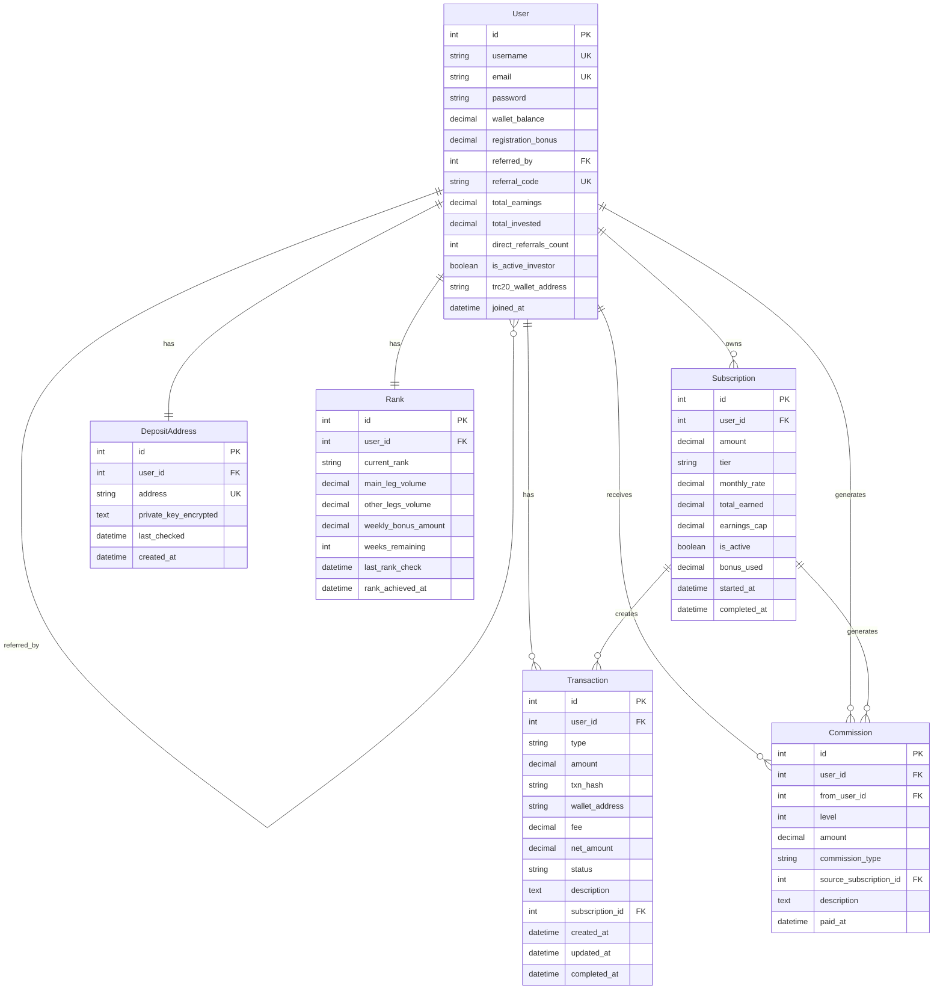

# Database Schema - Phonix MLM Platform

This document provides detailed information about the database schema, including all models, fields, relationships, and indexes.

## Table of Contents

1. [Entity Relationship Diagram](#entity-relationship-diagram)
2. [Models Overview](#models-overview)
3. [Detailed Schema](#detailed-schema)
4. [Relationships](#relationships)
5. [Indexes and Constraints](#indexes-and-constraints)
6. [Data Dictionary](#data-dictionary)

## Entity Relationship Diagram



## Models Overview

### Core Models

| Model | App | Purpose | Records (Est.) |
|-------|-----|---------|----------------|
| User | accounts | User authentication & MLM structure | 10,000+ |
| Subscription | investment | Investment packages | 50,000+ |
| Transaction | wallet | All financial movements | 500,000+ |
| Commission | earnings | MLM commission tracking | 1,000,000+ |
| DepositAddress | wallet | TRC20 deposit addresses | 10,000+ |
| Rank | ranks | User rank and bonuses | 10,000+ |

### Built-in Django Models

- **auth_user** (extended by User)
- **auth_group**
- **auth_permission**
- **django_session**
- **django_admin_log**
- **django_content_type**
- **django_migrations**

## Detailed Schema

### 1. User Model (accounts_user)

Extends Django's AbstractUser with MLM-specific fields.

| Field | Type | Constraints | Description |
|-------|------|-------------|-------------|
| id | BigInteger | PK, Auto | Primary key |
| username | CharField(150) | Unique, Not Null | Username (inherited) |
| email | EmailField(254) | Unique, Not Null | Email address |
| password | CharField(128) | Not Null | Hashed password |
| first_name | CharField(150) | Blank | First name |
| last_name | CharField(150) | Blank | Last name |
| is_staff | Boolean | Default: False | Admin access |
| is_active | Boolean | Default: True | Account active |
| is_superuser | Boolean | Default: False | Superuser status |
| date_joined | DateTime | Auto Now Add | Registration date |
| **wallet_balance** | Decimal(12,2) | Default: 0.00 | Main wallet balance (USDT) |
| **registration_bonus** | Decimal(5,2) | Default: 10.00 | Registration bonus ($10 max) |
| **referred_by** | ForeignKey | Null, FK to User | Referrer (upline) |
| **referral_code** | CharField(10) | Unique, Blank | Unique referral code |
| **total_earnings** | Decimal(12,2) | Default: 0.00 | Total all-time earnings |
| **total_invested** | Decimal(12,2) | Default: 0.00 | Total subscription investments |
| **direct_referrals_count** | Integer | Default: 0 | Count of direct referrals |
| **is_active_investor** | Boolean | Default: False | Has active subscription |
| **trc20_wallet_address** | CharField(50) | Null, Blank | Withdrawal address |
| **joined_at** | DateTime | Auto Now Add | Registration timestamp |

**Indexes**:
- `username` (Unique)
- `email` (Unique)
- `referral_code` (Unique)
- `referred_by_id`

**Constraints**:
- `total_earnings <= total_invested * 3` (3x cap, enforced in code)
- `wallet_balance + registration_bonus >= 0`

### 2. Subscription Model (investment_subscription)

Investment packages with tiered returns.

| Field | Type | Constraints | Description |
|-------|------|-------------|-------------|
| id | BigInteger | PK, Auto | Primary key |
| user_id | BigInteger | FK to User, Not Null | Subscription owner |
| amount | Decimal(10,2) | Not Null, >= 50 | Investment amount |
| tier | CharField(10) | Choices, Not Null | tier_1, tier_2, tier_3 |
| monthly_rate | Decimal(4,2) | Not Null | Monthly return % (6, 8, or 10) |
| total_earned | Decimal(10,2) | Default: 0.00 | Total earned from this subscription |
| earnings_cap | Decimal(10,2) | Auto: amount * 3 | Maximum earnings (3x) |
| is_active | Boolean | Default: True | Active for earning |
| bonus_used | Decimal(5,2) | Default: 0.00 | Registration bonus used |
| started_at | DateTime | Auto Now Add | Purchase timestamp |
| completed_at | DateTime | Null | When 3x cap reached |

**Indexes**:
- `user_id`
- `is_active`
- `started_at`

**Calculations**:
- Daily Income: `(amount * monthly_rate / 100) / 30`
- Tier Selection:
  - $50-$3,000 → Tier 1 (6%)
  - $3,001-$5,000 → Tier 2 (8%)
  - $5,001+ → Tier 3 (10%)

### 3. Transaction Model (wallet_transaction)

Tracks all financial movements in the system.

| Field | Type | Constraints | Description |
|-------|------|-------------|-------------|
| id | BigInteger | PK, Auto | Primary key |
| user_id | BigInteger | FK to User, Not Null | Transaction owner |
| type | CharField(20) | Choices, Not Null | Transaction type |
| amount | Decimal(12,2) | Not Null | Gross amount |
| txn_hash | CharField(100) | Null | Blockchain transaction hash |
| wallet_address | CharField(50) | Null | TRC20 address |
| fee | Decimal(8,2) | Default: 0.00 | Transaction fee |
| net_amount | Decimal(12,2) | Auto | Amount after fees |
| status | CharField(20) | Choices, Default: pending | Transaction status |
| description | TextField | Blank | Additional details |
| subscription_id | BigInteger | FK to Subscription, Null | Related subscription |
| created_at | DateTime | Auto Now Add | Creation timestamp |
| updated_at | DateTime | Auto Now | Last update |
| completed_at | DateTime | Null | Completion timestamp |

**Transaction Types**:
- `deposit` - TRC20 USDT deposit
- `withdrawal` - TRC20 USDT withdrawal (5% fee)
- `purchase` - Subscription purchase
- `commission` - Referral commission
- `bonus` - Registration bonus
- `daily_income` - Daily bond income
- `weekly_bonus` - Weekly rank bonus

**Status Flow**:
- `pending` → `processing` → `completed` / `failed` / `cancelled`

**Indexes**:
- `user_id, created_at` (Composite)
- `type, status`
- `txn_hash` (Unique if present)

### 4. Commission Model (earnings_commission)

Tracks all commission payments in the MLM structure.

| Field | Type | Constraints | Description |
|-------|------|-------------|-------------|
| id | BigInteger | PK, Auto | Primary key |
| user_id | BigInteger | FK to User, Not Null | Commission recipient |
| from_user_id | BigInteger | FK to User, Not Null | Who generated this commission |
| level | Integer | Not Null, 0-20 | Level in upline chain |
| amount | Decimal(10,2) | Not Null | Commission amount |
| commission_type | CharField(20) | Choices | generation / daily_bond |
| source_subscription_id | BigInteger | FK to Subscription, Null | Source subscription |
| description | TextField | Blank | Additional details |
| paid_at | DateTime | Auto Now Add | Payment timestamp |

**Commission Rates by Level**:
```python
{
    1: 10.0%,  # Direct referrals
    2: 5.0%,
    3: 3.0%,
    4: 2.0%,
    5: 2.0%,
    6-10: 1.0%,
    11-15: 0.5%,
    16-20: 0.3%
}
```

**Direct Requirements by Level**:
```python
{
    1-2: 0 directs,  # No requirement
    3-4: 2 directs,
    5-6: 3 directs,
    7-8: 4 directs,
    ...
    19-20: 10 directs
}
```

**Indexes**:
- `user_id, paid_at` (Composite)
- `from_user_id, paid_at` (Composite)
- `source_subscription_id`

### 5. DepositAddress Model (wallet_depositaddress)

Unique TRC20 addresses for each user.

| Field | Type | Constraints | Description |
|-------|------|-------------|-------------|
| id | BigInteger | PK, Auto | Primary key |
| user_id | BigInteger | FK to User, OneToOne | Address owner |
| address | CharField(50) | Unique, Not Null | TRC20 wallet address |
| private_key_encrypted | TextField | Blank | Encrypted private key (Fernet) |
| last_checked | DateTime | Null | Last deposit check time |
| created_at | DateTime | Auto Now Add | Creation timestamp |

**Security**:
- Private keys encrypted using Fernet (symmetric encryption)
- Keys never logged or exposed in errors
- Only decrypted when needed for consolidation

**Indexes**:
- `user_id` (Unique, OneToOne)
- `address` (Unique)

### 6. Rank Model (ranks_rank)

User rank based on leg volumes.

| Field | Type | Constraints | Description |
|-------|------|-------------|-------------|
| id | BigInteger | PK, Auto | Primary key |
| user_id | BigInteger | FK to User, OneToOne | Rank holder |
| current_rank | CharField(20) | Choices, Default: none | Current rank |
| main_leg_volume | Decimal(12,2) | Default: 0.00 | Largest leg volume |
| other_legs_volume | Decimal(12,2) | Default: 0.00 | Combined other legs |
| weekly_bonus_amount | Decimal(8,2) | Default: 0.00 | Weekly bonus for rank |
| weeks_remaining | Integer | Default: 0 | Weeks left (max 52) |
| last_rank_check | DateTime | Auto Now | Last rank calculation |
| rank_achieved_at | DateTime | Null | When current rank achieved |

**Rank Tiers**:
| Rank | Main Leg | Other Legs | Weekly Bonus |
|------|----------|------------|--------------|
| none | - | - | $0 |
| connector | $5,000 | $5,000 | $50 |
| builder | $10,000 | $10,000 | $200 |
| professional | $20,000 | $20,000 | $500 |
| executive | $50,000 | $50,000 | $1,000 |
| director | $100,000 | $100,000 | $2,000 |
| crown | $200,000 | $200,000 | $5,000 |

**Leg Calculation**:
- Main Leg: Largest direct referral leg volume
- Other Legs: Sum of all other direct referral legs
- Volume: Sum of all investments in leg (recursive)

**Indexes**:
- `user_id` (Unique, OneToOne)
- `current_rank`

## Relationships

### User Relationships

```
User (self-referential)
├── referred_by → User (parent/upline)
└── referrals ← User[] (children/downline)

User (one-to-many)
├── subscriptions → Subscription[]
├── transactions → Transaction[]
├── commissions_received → Commission[]
└── commissions_generated → Commission[]

User (one-to-one)
├── deposit_address → DepositAddress
└── rank → Rank
```

### Subscription Relationships

```
Subscription
├── user → User
├── transactions → Transaction[]
└── commissions → Commission[]
```

### Transaction Relationships

```
Transaction
├── user → User
└── subscription → Subscription (optional)
```

### Commission Relationships

```
Commission
├── user → User (recipient)
├── from_user → User (generator)
└── source_subscription → Subscription (optional)
```

## Indexes and Constraints

### Primary Indexes

All tables have auto-incrementing `id` as primary key.

### Unique Indexes

- `accounts_user.username`
- `accounts_user.email`
- `accounts_user.referral_code`
- `wallet_depositaddress.address`
- `wallet_depositaddress.user_id` (OneToOne)
- `ranks_rank.user_id` (OneToOne)

### Foreign Key Indexes

Django automatically creates indexes on all foreign keys:
- `accounts_user.referred_by_id`
- `investment_subscription.user_id`
- `wallet_transaction.user_id`
- `wallet_transaction.subscription_id`
- `earnings_commission.user_id`
- `earnings_commission.from_user_id`
- `earnings_commission.source_subscription_id`

### Composite Indexes

Defined in model Meta classes:
- `earnings_commission` on `(user_id, paid_at DESC)`
- `earnings_commission` on `(from_user_id, paid_at DESC)`

### Recommended Additional Indexes

For large-scale deployments:
```sql
CREATE INDEX idx_subscription_active ON investment_subscription(is_active, user_id);
CREATE INDEX idx_transaction_type_status ON wallet_transaction(type, status);
CREATE INDEX idx_transaction_created ON wallet_transaction(created_at DESC);
CREATE INDEX idx_user_investor ON accounts_user(is_active_investor);
```

## Data Dictionary

### Decimal Precision

All monetary values use `Decimal` type for precision:
- **12,2**: Large amounts (wallet balance, earnings) - $999,999,999.99 max
- **10,2**: Medium amounts (subscriptions) - $99,999,999.99 max
- **8,2**: Smaller amounts (fees, bonuses) - $999,999.99 max
- **5,2**: Tiny amounts (registration bonus) - $999.99 max
- **4,2**: Percentages (monthly rate) - 99.99% max

### Status Enums

**Transaction Status**:
- `pending` - Created, not yet processed
- `processing` - Currently being processed
- `completed` - Successfully completed
- `failed` - Processing failed
- `cancelled` - Cancelled by user/admin

**Subscription Tier**:
- `tier_1` - $50-$3,000 @ 6% monthly
- `tier_2` - $3,001-$5,000 @ 8% monthly
- `tier_3` - $5,001+ @ 10% monthly

**Rank Level**:
- `none` - No rank achieved
- `connector` - Entry rank
- `builder` - Growth stage
- `professional` - Intermediate
- `executive` - Advanced
- `director` - Leadership
- `crown` - Top tier

### Date/Time Fields

All timestamps use Django's timezone-aware datetime:
- Stored in UTC
- Displayed in user's local timezone
- Format: `YYYY-MM-DD HH:MM:SS+00:00`

## Migration Strategy

### Creating Migrations

```bash
# Create migration files
python manage.py makemigrations

# Review migration
python manage.py sqlmigrate accounts 0001

# Apply migrations
python manage.py migrate
```

### Backup Before Migration

```bash
# PostgreSQL backup
pg_dump -U phonix_user phonix_db > backup_$(date +%Y%m%d).sql

# Restore if needed
psql -U phonix_user phonix_db < backup_20240101.sql
```

### Zero-Downtime Migrations

For production:
1. Add new fields as nullable
2. Deploy code to populate new fields
3. Run data migration
4. Make fields non-nullable if needed
5. Remove old fields in separate migration

## Data Retention

### Active Data
- Users: Indefinite
- Subscriptions: Indefinite
- Transactions: Indefinite (required for audit)
- Commissions: Indefinite

### Cleanup Recommendations

Consider archiving:
- Completed transactions older than 2 years
- Inactive user sessions older than 30 days
- Failed transaction records older than 90 days

```python
# Example cleanup task (create as management command)
from django.utils import timezone
from datetime import timedelta

cutoff_date = timezone.now() - timedelta(days=730)
Transaction.objects.filter(
    status='failed',
    created_at__lt=cutoff_date
).delete()
```

---

This schema is designed for:
- **Data Integrity**: Foreign keys and constraints
- **Performance**: Strategic indexes on common queries
- **Auditability**: Complete transaction history
- **Scalability**: Efficient relationships and minimal redundancy
